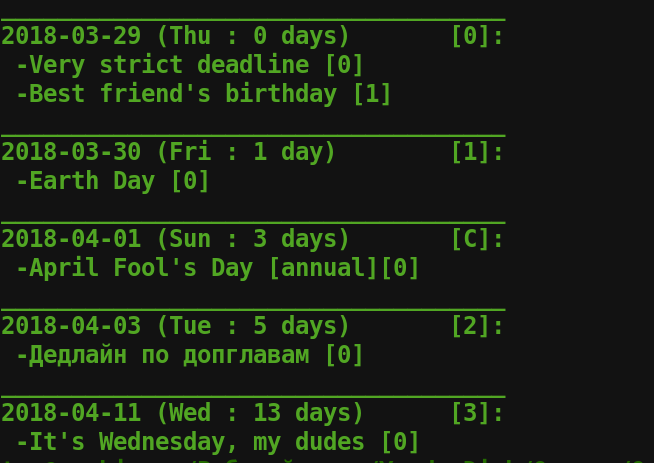

# Future

Terminal organizer.

## Installation

Download contents to convenient directory. Add line
"export PATH=$PATH:<path>" to the end of your ".bashrc" file in your home directory, where
<path> is the path to the "future" file. Reboot. Now you should be able to start
by typing "future" in your terminal.
Tested on Ubuntu 18.04.

## Usage

Type 'future help' in your terminal to see short manual.

## Screenshot

